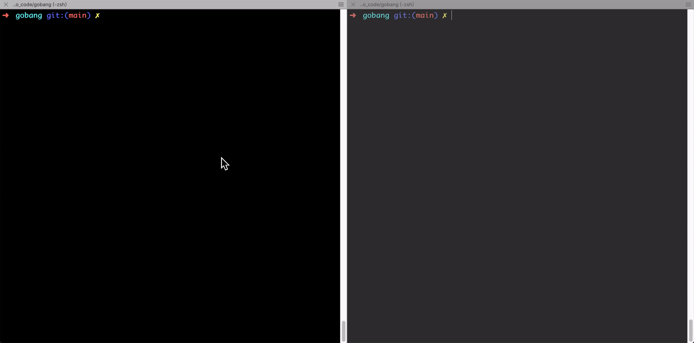

## 一款命令行玩五子棋的游戏：

### 演示:




------

### 启动步骤：

1. ### 安装环境 ：

   ```shell
   go mod download
   ```

2. ### 启动服务端：

   ```shell
   go run server.go
   ```

3. ### 启动客户端：

   ```shell
   go run client.go
   ```

4. ##### 一个客户端创建房间，一个客户端加入房间即可自动开始游戏


------

### 项目开发构想（第一版）v1.0.0：

1. `玩家唯一标识还在考虑。。。`
2. 支持多用户，多个用户同时玩，对局之间不干扰
3. 客户端启动后，可选择创建房间或者输入房间号加入一个房间，进入房间后可按R键准备，创建房间后默认为准备状态，按R键取消准备，当房间人数2人，并且都准备了，可自动开启对局。
4. 客户端支持上下左右移动光标，空格键下子，回车键确认下子
5. 随机分配玩家的棋子为黑或白（即确认谁先走），开局时确认。

##### 开发构想（第二版）v1.0.1：

1. 添加悔棋功能，悔棋需要对手同意才可以悔棋
2. 房主可在开局前调整总局时、步时。当然，后台也会默认配置（或者默认不配置，只限制最长时长）
3. 下子时可支持鼠标点击下子
4. 服务端保存对局步骤，可复盘

##### 开发构想（第三版）v1.0.2：

1. 添加观战模式，输入房间号可观战
2. 添加发送即时消息功能


------

### 目前已知待优化问题：

1. ##### 服务端没有清理创建了但未开始游戏和已经结束游戏的房间，会造成内存浪费

2. ##### 玩家唯一标识目前没做，掉线后无法重连，目前是基于连接过来的ip+端口做的唯一标识

3. ##### 心跳包目前未做，一方退出游戏之后，因为是基于UDP，所以服务器无法知晓，对手玩家也不知道，没有任何提示，不够友好

4. ##### 游戏结束后客户端直接进程退出，应该有**`再来一局`**功能

5. ##### 服务端没有对对局进行记录，无法复盘


------

### 目前基本实现了1.0.0版本需要的功能

##### 未完待续。。。
